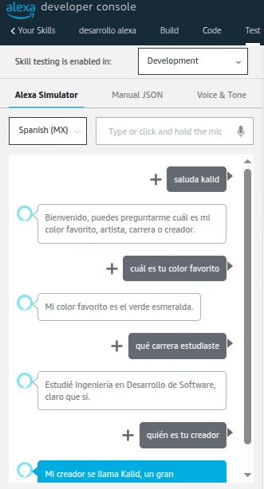
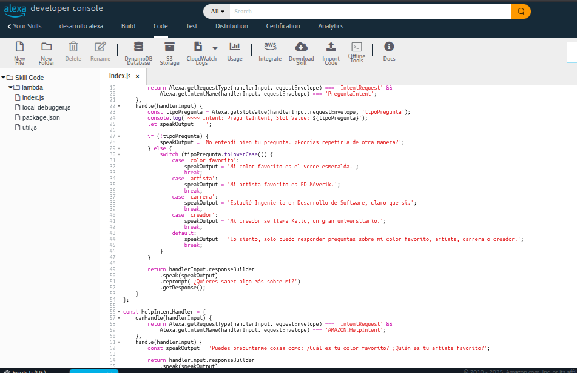

# DATOS DEL ESTUDIANTE
nombre: Brayn Kalid Reyes Silva
carrera: Ingeniería en Desarrollo de Software
profesor: Marco Antonio Ramírez Hernández
materia: Extracción de Conocimiento en Bases de Datos
grado_grupo: 9°A

# 📌 DESCRIPCIÓN DE LA SKILL
skill:
  nombre: Saluda Kalid
  descripcion: >
    Esta skill responde por comandos de voz a cuatro preguntas estáticas definidas por el estudiante.
    Fue creada con el Alexa Skills Kit en Node.js usando la consola de desarrollo de Alexa.

# 🤖 INTENT PERSONALIZADO
intents:
  - nombre: PreguntaIntent
    slot: tipoPregunta
    tipo_personalizado: TIPO_PREGUNTA
    valores_slot:
      - color favorito
      - artista
      - carrera
      - creador

# 🗣️ UTTERANCES PERSONALIZADAS
utterances:
  - "¿Cuál es tu {tipoPregunta}?"
  - "Dime tu {tipoPregunta}"
  - "Quiero saber tu {tipoPregunta}"
  - "Cuéntame tu {tipoPregunta}"
  - "¿Qué {tipoPregunta} es?"
  - "¿Sabes tu {tipoPregunta}?"

  # Imagen de la practica

  

 

# 💬 RESPUESTAS ESTÁTICAS
respuestas_programadas:
  color favorito: "Mi color favorito es el verde esmeralda."
  artista: "Mi artista favorito es ED Maverik."
  carrera: "Estudié Ingeniería en Desarrollo de Software, claro que sí."
  creador: "Mi creador se llama Kalid, un gran universitario."

# 🧪 PRUEBAS REALIZADAS
pruebas:
  - pregunta: "¿Cuál es tu color favorito?"
    resultado: Correcto

  - pregunta: "¿Cuál es tu artista favorito?"
    resultado: Correcto

  - pregunta: "¿Qué carrera estudiaste?"
    resultado: Correcto

  - pregunta: "¿Quién es tu creador?"
    resultado: Correcto

  - pregunta: "¿Cuál es tu comida favorita?"
    resultado: Controlado (respuesta genérica)

# 🧩 TECNOLOGÍAS UTILIZADAS
tecnologias:
  - Alexa Skills Kit SDK v2
  - Node.js (Alexa Hosted)
  - Alexa Developer Console

# 📁 ESTRUCTURA DEL PROYECTO
estructura:
  - index.js
  - skill.json
  - models/es-MX.json
  - lambda/custom/index.js
  - README.md

# 📌 RECOMENDACIÓN DE EJECUCIÓN
ejecucion:
  pasos:
    - Subir el código a Alexa Developer Console
    - Activar modo "Test"
    - Probar frases como "¿Cuál es tu artista favorito?" o "¿Qué carrera estudiaste?"

# ✅ RESULTADO FINAL
resultado: Skill funcional, desplegada y probada con éxito
